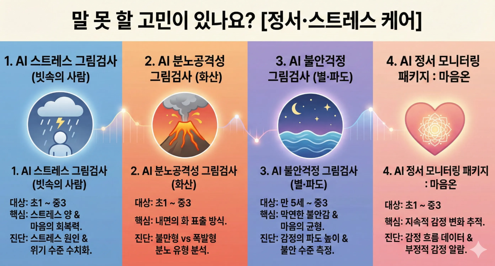

# 말하지 않는 아이 속마음, 10가지 ‘AI 그림심리검사’로 정확하게 읽는 법

### 왜 지금 'AI 그림심리검사'인가요?

"오늘 학교에서 별일 없었어?"라고 물으면 "그냥 그랬어"라고 답하는 우리 아이. 겉으로는 평온해 보여도 마음속에는 말 못 할 스트레스나 불안이 자리 잡고 있을 수 있습니다.

그림은 아이의 무의식을 드러내는 가장 솔직한 언어입니다. 아트봉봉은 미술 심리 이론에 최첨단 **AI 그림 분석 기술**을 더했습니다. 주관적인 해석을 넘어, 객관적인 데이터(크기, 위치, 필압, 색상 패턴 등)를 통해 아이의 심리 상태를 백분위와 등급으로 정밀하게 진단합니다.

단순히 문제를 찾는 것을 넘어, 아이의 잠재력을 발견하고 건강한 성장을 돕는 아트봉봉의 10가지 검사 도구를 **학부모님의 고민 키워드별로** 정리해 드립니다.

## Part 1. 말 못 할 고민이 있나요? [정서·스트레스 케어]

아이가 평소보다 예민하거나 기운이 없어 보일 때, 마음의 날씨를 확인해 보세요.

**1. AI 스트레스 그림검사 (빗속의 사람)**

- **대상:** 초1 ~ 중3
- **핵심:** 스트레스의 양과 **마음의 회복력**(힘든 일을 툭 털고 일어나는 힘)을 동시에 파악합니다.
- **진단:** 현재 아이를 짓누르는 스트레스 원인이 무엇인지, 위기 수준은 아닌지 객관적 수치로 확인합니다.

**2. AI 분노공격성 그림검사 (화산)**

- **대상:** 초1 ~ 중3
- **핵심:** 아이 내면의 화가 밖으로 어떻게 표출되는지 확인합니다.
- **진단:** 화산 폭발 그림을 통해 꾹꾹 눌러 담은 불만형인지, 한 번에 터뜨리는 폭발형인지 분노의 유형을 분석합니다.

**3. AI 불안걱정 그림검사 (별·파도)**

- **대상:** 만 5세 ~ 중3
- **핵심:** 막연한 불안감과 마음의 균형 상태를 점검합니다.
- **진단:** 밤하늘의 별과 파도를 통해 현재 감정의 파도 높이와 불안 수준을 정밀하게 측정합니다.

**4. AI 정서 모니터링 패키지 : 마음온**

- **대상:** 초1 ~ 중3
- **핵심:** 일회성이 아닌 '지속적인' 감정 변화 추적 시스템입니다.
- **진단:** 주기적인 만다라 채색 활동을 통해 감정 흐름을 데이터로 쌓고, 부정적 감정이 감지되면 알람을 제공하여 위기를 예방합니다.

## Part 2. 학교생활과 관계가 걱정되나요? [사회성·관계 점검]

친구 관계나 가족 간의 소통 방식이 궁금할 때 추천합니다.

**5. AI 사회성 그림검사 (사람)**

- **대상:** 초1 ~ 중3
- **핵심:** 아이가 생각하는 '나'와 타인과의 관계 맺기 방식을 봅니다.
- **진단:** **나를 바라보는 시선(자아 개념)**과 소통 능력을 5단계(매우 낮음~매우 높음)로 평가하고, 개인화된 심리 가이드를 제공합니다.

**6. AI 동물가족 그림검사 (가족 소통)**

- **대상:** 미취학 ~ 초6
- **핵심:** 아이 눈에 비친 우리 가족의 모습과 **가족 간의 소통 흐름**입니다.
- **진단:** 가족 구성원을 특정 동물로 표현하고 배치하는(디지털 스티커) 방식을 통해 가족 간의 친밀도와 상호작용 패턴을 분석합니다.

## Part 3. 숨겨진 재능을 찾고 싶나요? [잠재력·성향 파악]

문제가 없더라도, 아이를 더 깊이 이해하고 강점을 키워주고 싶을 때 유용합니다.

**7. AI 자기이해 그림검사 (집-나무)**

- **대상:** 만 5세 ~ 중3
- **핵심:** 자존감과 **마음 근육의 단단함(자아 건강성)**을 확인합니다.
- **진단:** 집과 나무 그림을 통해 아이의 자신감 수준과 정서적 안정성을 파악하여 단단한 마음을 기를 수 있게 돕습니다.

**8. AI 정서유형 색칠검사 (만다라)**

- **대상:** 만 5세 ~ 초6
- **핵심:** **내 아이의 감정 색깔(정서 유형)** 파악과 집중력 훈련을 동시에 합니다.
- **진단:** 색상 선택과 채색 패턴을 분석해 과제 집중력을 4단계로 측정하며, 검사 과정 자체가 힐링의 시간이 됩니다.

**9. 색채능력검사 (컬러 인지)**

- **대상:** 만 5세 ~ 초2
- **핵심:** 색을 통해 세상을 인지하고 표현하는 능력을 봅니다.
- **진단:** 색채 인지, 정서, 언어 능력을 종합 평가합니다. 특히 저학년 아이들의 일상 적응력을 파악하는 데 유용합니다.

**10. 그림 MBTI (성향 파악)**

- **대상:** 전 연령
- **핵심:** 글자보다 그림으로 알아보는 직관적인 성향 테스트입니다.
- **진단:** 선호하는 그림 카드를 선택하는 방식으로, 아이의 타고난 성격 유형(16가지)을 파악해 맞춤형 양육 정보를 제공합니다.

### 검사 그 이후, '치유'와 '성장'으로 이어집니다

검사 결과는 끝이 아니라 시작입니다. 아트봉봉의 AI 그림심리검사는 단순히 "아이가 스트레스가 많네요"라고 통보하는 데 그치지 않습니다.

검사 결과를 바탕으로 **1:1 라이브 미술 수업**과 연계하여, 아이가 미술 활동을 통해 부정적인 감정을 해소하고 자존감을 회복하도록 돕습니다. 몰입의 즐거움을 느끼며 창의력을 키우는 과정, 아트봉봉이 아이의 마음 근육을 단단하게 만들어 드립니다.

지금 우리 아이의 마음, 늦지 않게 두드려주세요.

---

### ❓ 자주 묻는 질문(FAQ)

**Q1. 그림 실력이 결과에 영향을 미치나요?**

A1. 아닙니다. AI 분석은 그림의 '잘 그림/못 그림'이 아니라, 선의 압력, 위치, 크기, 색상 사용 패턴 등 심리적 기제를 나타내는 요소를 분석하므로 그림 실력과는 무관합니다.

**Q2. 검사 시간은 얼마나 걸리나요?**

A2. 대부분의 검사는 10~20분 내외로 진행되며, 집에서 태블릿이나 PC를 통해 편안한 환경에서 진행할 수 있어 아이들이 부담감을 느끼지 않습니다.

**Q3. 결과는 바로 알 수 있나요?**

A3. 네, 검사 완료 후 AI 분석을 거쳐 상세한 결과 리포트를 빠르게 받아보실 수 있습니다.

**Q4. 어떤 검사를 받아야 할지 모르겠어요.**

A4. 특별한 문제가 없다면 아이의 전반적인 성향을 파악하는 '그림 MBTI'나 'AI 자기이해 그림검사'로 시작해보시는 것을 추천합니다.

**Q5. 병원 기록에 남나요?**

A5. 아닙니다. 아트봉봉의 검사는 의료 기록이 남지 않으며, 가정에서 아이의 마음을 점검하고 예방하는 목적으로 안전하게 활용하실 수 있습니다.
