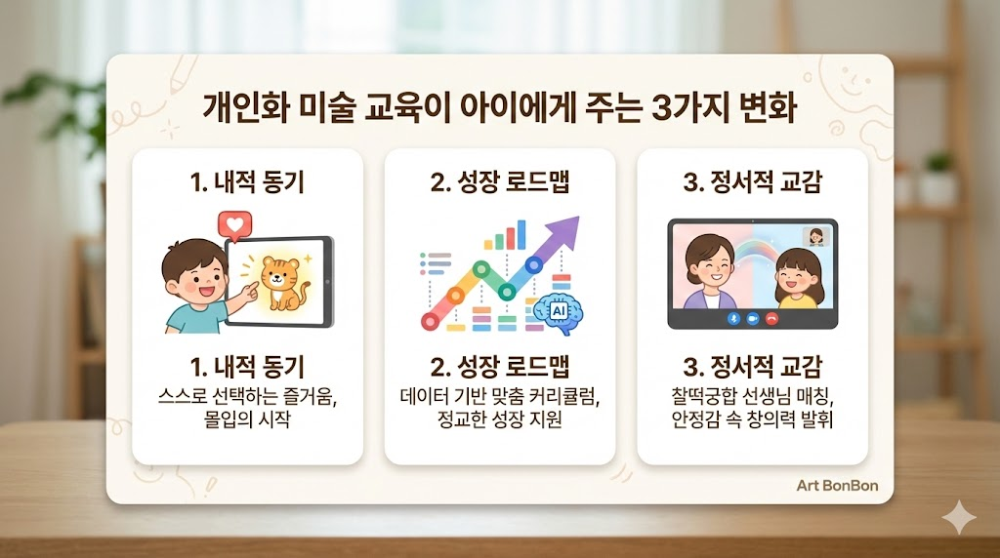

# 우리 아이 창의성, '맞춤형 알고리즘'으로 깨우다

### 🚀 왜 지금 '개인화 교육'인가?

최근 교육계의 가장 큰 변화는 AI를 활용한 '개인화 학습'입니다. 
2025년부터 도입된 AI 디지털 교과서가 보여주듯, 이제는 모두가 똑같은 속도로 배우는 시대가 아닙니다. 🏃‍♂️💨

심리학자 칙센트미하이는 아이가 자신의 역량에 딱 맞는 과제를 만났을 때 깊은 **'몰입(Flow)'** 🧠 상태에 빠진다고 설명합니다. 너무 쉬우면 지루하고, 너무 어려우면 포기하게 되죠. 아트봉봉은 이 '딱 적당한 난이도'를 알고리즘으로 찾아내 아이가 미술에 푹 빠지게 만듭니다.

### 💡 학부모가 꼭 알아야 할 개인화 미술의 3가지 포인트

1. **스스로 고르는 '내적 동기'** 🌟: 아이가 좋아하는 동물이나 캐릭터로 수업을 시작하면 미술은 '공부'가 아닌 '즐거운 창작'이 됩니다.
2. **데이터로 쌓이는 '성장 로드맵'** 📈: 수업 데이터가 쌓일수록 AI는 아이의 변화하는 관심사에 맞춰 커리큘럼을 더 정교하게 다듬어갑니다.
3. **마음이 통하는 '찰떡궁합 선생님'** 🤝: 아이의 성향과 가장 잘 맞는 선생님을 매칭해 정서적 안정감 속에서 창의성을 키워줍니다.

### ✅ 우리 아이에게 맞는 수업 모드는?

- [ ]  **아이의 주관이 뚜렷하다면?** ➡️ **픽앤플레이(Pick&Play)**: 스스로 골라 담는 자유로운 수업!
- [ ]  **효율적인 관리가 필요하다면?** ➡️ **스마트픽(Smart-Pick)**: AI가 찾아주는 최적의 맞춤 코스!
- [ ]  **깊이 있는 탐구를 원한다면?** ➡️ **테마박스(Theme Box)**: 하나의 주제를 패키지로 심도 있게!
- [ ]  **정해진 틀이 싫다면?** ➡️ **프리드로우(Free-Draw)**: 하얀 캔버스 위에 무한한 상상력을!

### ✨ '나다운 것'이 가장 창의적인 것입니다

심리학자 칼 로저스는 '자기표현'이 창의성의 핵심이라고 말했습니다. 아이가 자신의 느낌을 자유롭게 표현할 때 비로소 독창적인 예술이 시작됩니다. 
아트봉봉과 함께 아이만의 색깔을 찾아가는 여정을 시작해 보세요! 🌈