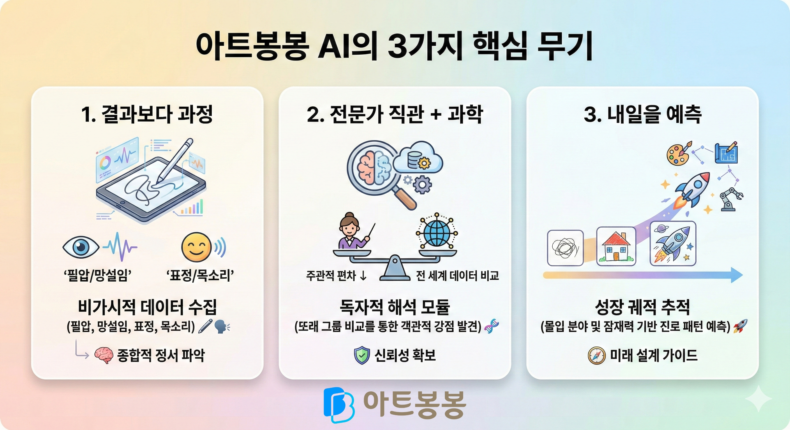

# "우리 아이의 도화지는 데이터로 된 편지입니다" 아트봉봉 AI 그림분석

부모님들은 아이가 그린 그림 한 점을 보며 수많은 생각을 합니다. "왜 갑자기 검은색을 썼을까?", "이 구도는 아이의 자신감을 나타내는 걸까?" 하지만 전문가가 아닌 이상 그 속마음을 정확히 읽어내기란 쉽지 않죠. 
디지털 아트 교육 플랫폼 '아트봉봉'은 부모님의 이 막연한 궁금증에 과학적인 해답을 제시합니다. 🎨

## 🔍 왜 지금 '분석형 AI'가 필요한가요?

단순히 명령어를 입력해 그림을 그려주는 생성형 AI(ChatGPT 등)와 아트봉봉의 AI는 목적부터 다릅니다. 아트봉봉은 '아이를 이해하기 위한 도구'로서 존재합니다. 
미술은 정답이 없기에 선생님의 주관에만 의존하기 쉽지만, 아트봉봉은 전 세계 수만 건의 어린이 그림 데이터를 바탕으로 **객관적인 성장 지표**를 제공합니다.

## 💡 학부모가 신뢰할 수 있는 아트봉봉 AI의 3가지 핵심 무기

### 1. "결과보다 과정을 기록합니다" – 비가시적 데이터 수집

아이의 성장은 완성된 그림보다 '그리는 순간'에 더 많이 담겨 있습니다.

- **그리기 로그 분석:** 어떤 선을 먼저 그었는지, 색을 고를 때 얼마나 망설였는지, 필압(누르는 힘)의 변화는 어떠했는지를 정밀하게 기록합니다. 🖋️
- **멀티모달 데이터:** 수업 중 아이의 밝은 표정, 자신감 있는 목소리 톤까지 분석하여 아이의 정서 상태를 종합적으로 파악합니다. 🗣️

### 2. "전문가의 직관에 과학적 근거를 더합니다" – 독자적 해석 모듈

심리, 미술, IT 분야의 전문가들이 협업하여 만든 이 시스템은 '선생님의 주관적 편차'를 줄여줍니다. 우리 아이가 가진 고유한 강점을 전 세계 또래 그룹의 평균 데이터와 비교하여 객관적으로 보여줍니다. 🧬

### 3. "단순 진단을 넘어 아이의 내일을 예측합니다"

그림의 변화는 곧 아이 성격과 적성의 변화입니다. 아트봉봉은 이 궤적을 추적하여 아이가 어떤 분야에 몰입할 때 가장 행복한지, 어떤 잠재력이 꿈틀대고 있는지 진로 패턴을 예측합니다. 🚀

## 📅 한눈에 보는 단계별 AI 리포트: 데이터로 쓰는 성장 일기

| **구분** | **AI가 분석하는 핵심 내용** | **부모님을 위한 맞춤형 가이드 팁** | **상태** |
| --- | --- | --- | --- |
| **단기(1개월)** | 현재의 흥미도, 주요 색채 성향 | "아이가 요즘 이 색에 꽂혔네요! 집에서도 이 색과 관련된 활동을 해보세요." | **준비 중** 🛠️ |
| **중기(3개월)** | 고유한 표현 스타일, 몰입 패턴 | "아이만의 독창적인 선이 나타나기 시작했습니다. 이 부분을 구체적으로 칭찬해 주세요!" | **준비 중** 🛠️ |

## 🌈 아트봉봉과 함께라면 그림은 세상에서 가장 솔직한 '언어'가 됩니다

미술은 아이가 세상에 내미는 손길입니다. 아트봉봉은 그 손길이 담고 있는 온기와 의미를 부모님이 이해할 수 있는 '데이터의 언어'로 번역합니다. 아이의 숨은 재능을 발견하고, 그 재능이 미래의 확신으로 연결될 수 있도록 아트봉봉의 AI가 든든한 등대가 되어 드리겠습니다. 🕯️

지금, 아이의 도화지 속에 숨겨진 이야기를 아트봉봉과 함께 읽어보시겠어요?

---

## 🧐 자주 묻는 질문(FAQ)

**Q1. AI가 우리 아이를 수치로만 판단하는 건 아닐까요?**
A1. 절대 그렇지 않습니다. AI는 객관적인 기초 데이터를 제공할 뿐, 이를 해석하고 아이의 마음을 어루만지는 것은 전문 선생님의 몫입니다. AI는 선생님이 아이를 더 깊이 이해하도록 돕는 강력한 조력자입니다. 😊

**Q2. 기계적인 분석이 아이의 창의성을 해치지는 않을까요?**

A2. 오히려 반대입니다. 아이가 어떤 부분에서 창의적인 시도를 하는지 데이터를 통해 발견함으로써, 선생님은 그 싹을 더 크게 키워줄 수 있는 맞춤형 수업을 설계할 수 있습니다.