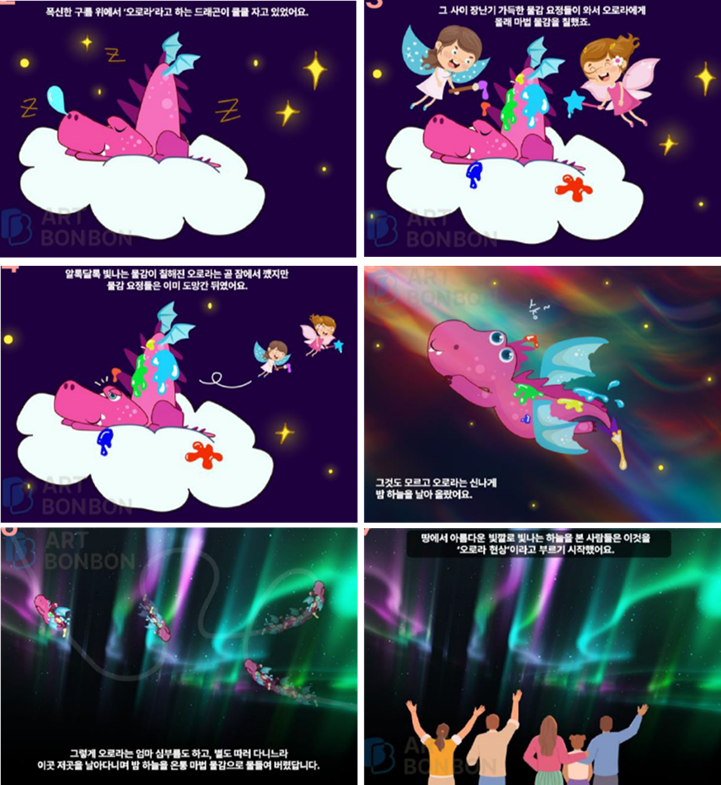

# 빈 도화지가 두려운 아이, '이야기'가 붓을 들게 합니다

## 왜 지금 '스토리텔링 미술'인가요?

"오늘 뭐 그릴 거야?"라고 물었을 때, "몰라요"라며 빈 도화지만 멍하니 바라보는 아이. 그림 실력이 부족해서가 아닙니다. **그릴 '이야기'가 없기 때문입니다.**

어릴 적 할머니 무릎을 베고 듣던 옛날이야기, 밤새 읽었던 소설 속 주인공이 된 듯한 기분을 기억하시나요? 교육심리학자 제롬 브루너(Jerome Bruner)는 "스토리를 통해 배운 내용은 단순 정보보다 22배 더 오래 기억된다"고 강조했습니다. 이야기는 지식을 단순한 정보가 아닌 '감각적인 경험'으로 바꿔주기 때문입니다.

### **최근 마케팅 트렌드도 '스토리'입니다.**

태풍에도 떨어지지 않은 사과를 '합격 사과'로 브랜딩 한 일본 아오모리현의 사례, 그리고 김밥과 관련 없는 지역이지만 '김밥천국'이라는 언어유희 스토리를 입혀 10만 명을 불러 모은 '2024 김천 김밥축제'가 대표적입니다. 사람의 마음을 움직이는 것은 화려한 기술 이전에 공감할 수 있는 '이야기'입니다. 미술 교육도 마찬가지입니다.

## 학부모가 알아야 할 핵심: '결말 없는 동화'의 비밀

아트봉봉 몽드(Monde) 수업에는 특별한 규칙이 있습니다. 바로 **동화에 '결말'이 없다는 점**입니다.

### 1. 아이를 '소비자'에서 '창작자'로 바꿉니다

일반적인 동화책은 작가가 만든 결론을 아이가 수동적으로 받아들입니다. 하지만 몽드의 500여 편 창작 동화는 결정적인 순간에 멈춥니다.

- "그다음엔 어떻게 됐을까?"
- "네가 주인공이라면 어떻게 해결할래?"

이 질문이 던져지는 순간, 아이는 수업의 대상이 아니라 이야기를 완성하는 주체(Storyteller)가 됩니다.

### 2. 25가지 창의사고기법으로 생각의 물꼬를 틉니다

막연히 상상하라고 하면 어렵습니다. 몽드는 스캠퍼(SCAMPER), 마인드맵 등 25가지 창의사고기법을 적용해 아이가 구체적인 이미지를 떠올리도록 돕습니다. 이야기를 통해 자연스럽게 학습 주제(명암, 원근법, 색채 등)를 이해하고, 자신만의 독창적인 아이디어를 시각화하게 됩니다.

## [실제 수업 사례] 하늘에 풀린 물감 '오로라'

실제 아트봉봉 수업에서 아이들이 어떻게 스토리를 그림으로 완성해가는지, **'오로라 그리기(몽드 레벨2)'** 수업 과정을 따라가 보겠습니다.

수업 주제별 동화 예시, ‘하늘에 풀린 물감’ 中 

### Step 1. 상상의 문을 여는 이야기

수업은 선생님이 들려주는 흥미진진한 이야기로 시작합니다.

> "오로라라는 드래곤이 자는 동안, 장난꾸러기 물감 요정들이 몸에 마법 물감을 칠했어! 잠에서 깬 오로라가 밤하늘을 날아다니자 온 세상이 아름다운 빛깔로 물들었지."
> 

과학적인 원리 설명 대신, 아이들의 눈높이에 맞춘 판타지 스토리가 호기심을 자극합니다.

### Step 2. 나만의 스토리 상상하기

이제 아이 차례입니다. "내가 오로라 드래곤이라면 어떤 색으로 하늘을 칠할까?"

- **아이의 생각:** "나는 숲속 친구들이 무서워하지 않게 따뜻한 핑크색으로 칠할래요!", "뾰족한 나무 사이로 별빛도 넣을 거예요."

단순히 풍경을 그리는 것이 아니라, **자신의 의도와 감정이 담긴 장면**을 기획합니다.

### Step 3. 디지털 툴로 생각을 현실로

상상한 이미지를 아트봉봉의 디지털 드로잉 툴로 표현합니다.

- **스머지(Smudge) 기법:** 손가락으로 문지르듯 색을 번지게 해 오로라의 몽환적인 느낌을 냅니다.

‘하늘에 풀린 물감’ - 작품 예시

- **레이어 & 그라데이션:** 빛이 퍼지는 효과를 사실적으로 구현합니다.

이야기에 몰입했기 때문에 아이들은 어려운 디지털 툴 기능도 '공부'가 아닌 '놀이 도구'로 받아들이고 적극적으로 배웁니다.

## 그림 그리는 힘, '서사'에서 나옵니다

"그림 그려봐"라는 말보다 "이 다음에 어떻게 됐을까?"라는 질문이 아이의 붓을 움직이게 합니다.

뇌과학적으로도 이야기 기반 학습은 아이의 **공감 능력**과 **문제 해결력**을 키우는 데 탁월합니다. 자신이 만든 이야기 속에서 문제를 발견하고, 그림이라는 도구로 해결책(결말)을 제시하는 과정 자체가 고도의 사고 훈련이기 때문입니다.

아트봉봉 몽드는 텅 빈 도화지를 두려워하는 아이에게 '이야기'라는 지도를 쥐여줍니다. 내성적인 아이도, 표현이 서툰 아이도 몽드의 이야기 세상 속에서는 멋진 작가가 됩니다.

**이번 주, 우리 아이에게 세상에 하나뿐인 결말을 그릴 기회를 선물해 주는 건 어떨까요?**

아이의 내면에 잠든 '스토리텔러'를 아트봉봉이 깨워드리겠습니다.

---

### ❓ 자주 묻는 질문(FAQ)

**Q1. 아이가 그림 실력이 없어도 이야기를 잘 만들 수 있나요?**

A1. 네, 물론입니다. 아트봉봉은 그림 기술만 가르치지 않습니다. 선생님과 대화하며 상상하는 과정 자체가 수업의 핵심입니다. 디지털 툴의 도움을 받으면 서툰 손길도 멋진 작품으로 완성될 수 있어 자신감이 높아집니다.

**Q2. 수업 시간 내에 그림을 다 완성하나요?**

A2. 대부분 완성하지만, 속도보다 중요한 것은 '몰입'입니다. 아이가 이야기에 빠져 디테일을 묘사하느라 시간이 걸린다면, 이는 매우 긍정적인 신호입니다. 남은 부분은 과제로 이어하거나 다음 시간에 마무리할 수 있습니다.

**Q3. 일반 미술 학원과 가장 큰 차이점은 무엇인가요?**

A3. '따라 그리기'가 아닌 '생각하고 그리기'를 지향합니다. 정해진 샘플을 모작하는 것이 아니라, 창작 동화를 듣고 자신만의 해석을 그림으로 표현하는 '창의 융합 미술'입니다.