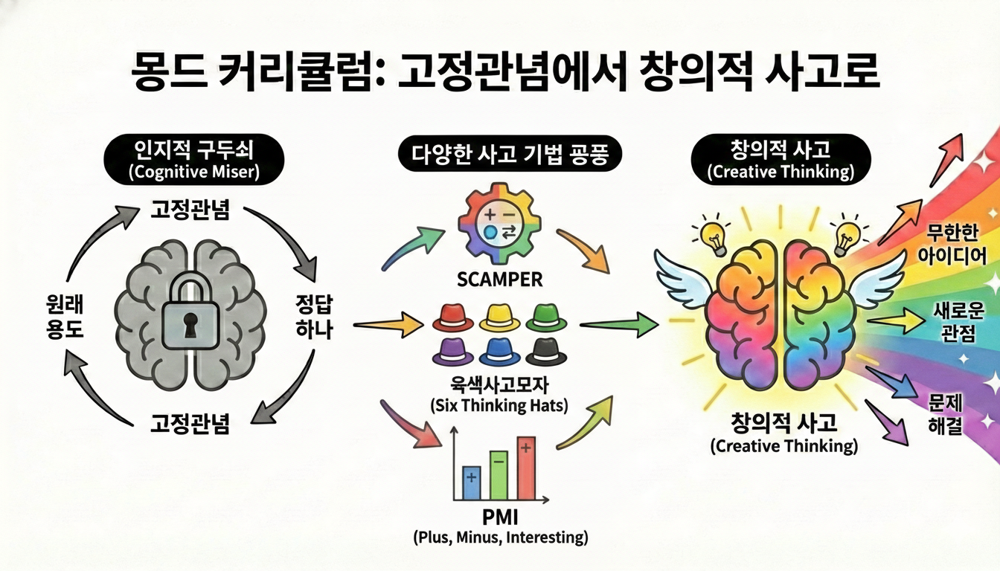
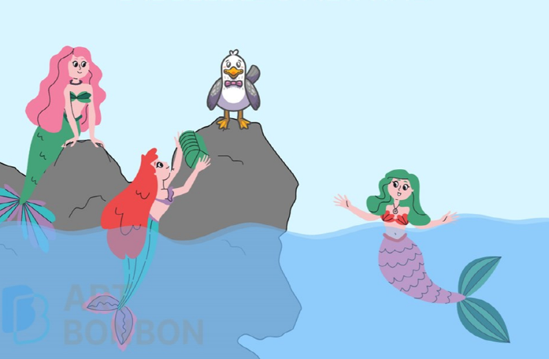
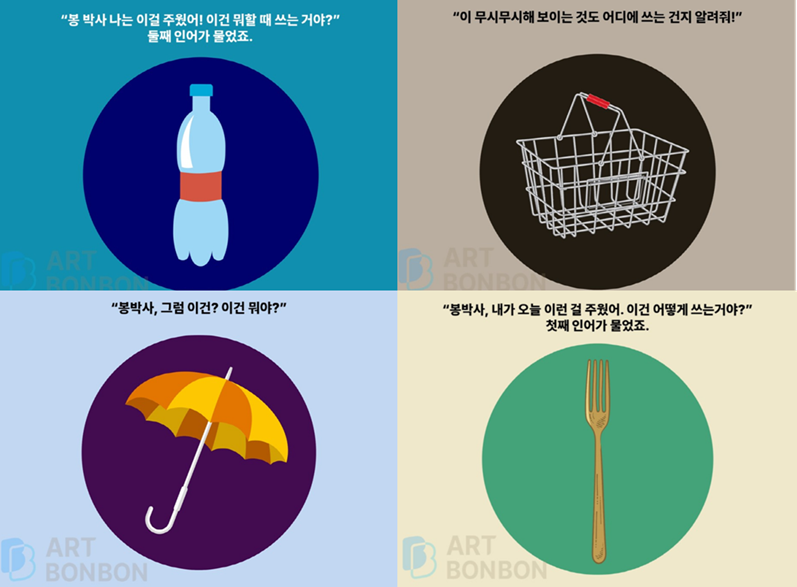
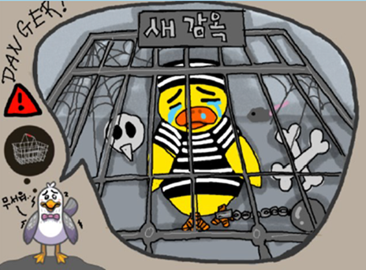
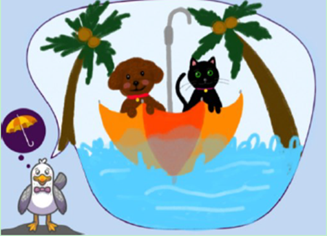
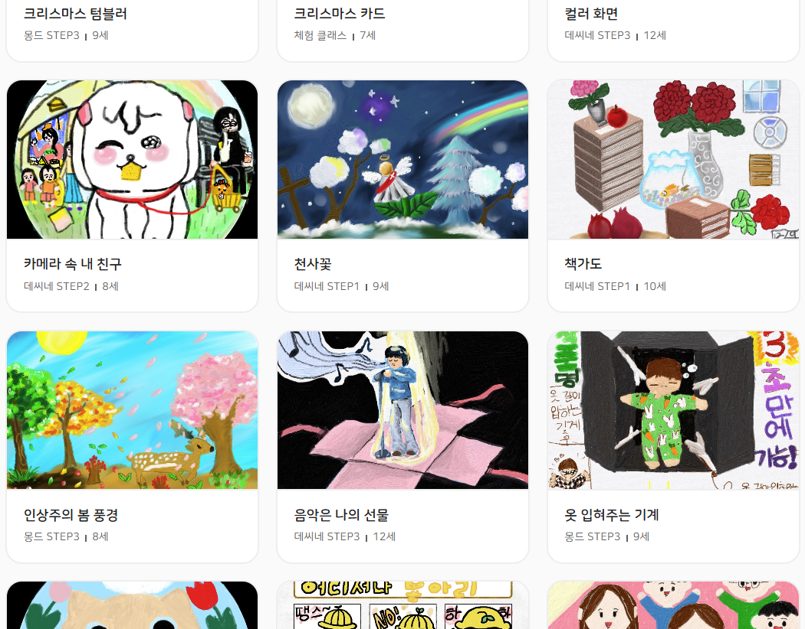

# 창의성, 타고나지 않아도 괜찮아! 우리 아이 '생각 근육' 키우는 법

### 창의성은 선물일까, 아니면 습관일까?

"창의성은 타고나는 걸까요, 아니면 길러지는 걸까요?"

많은 분이 궁금해하지만, 사실 창의성은 훈련과 경험을 통해 충분히 길러질 수 있습니다. 마치 운동으로 신체를 단련하듯, 꾸준한 '생각의 훈련'을 통해 성장할 수 있는 능력이죠.

창의성 연구의 대가인 테레사 에머빌(Teresa Amabile) 교수는 이렇게 강조했습니다.

> “창의성은 소수에게만 주어지는 특별한 재능이 아니라, 환경과 동기부여에 따라 크게 달라질 수 있는 능력이다.”
> 

즉, 흥미를 느낄 수 있는 환경과 반복적인 사고 훈련만 있다면 우리 아이도 얼마든지 창의적인 인재로 자랄 수 있다는 뜻입니다. 그리고 '미술'은 이 창의성을 키우는 데 가장 좋은 환경이자 효과적인 '훈련 도구'입니다.

### 미술로 '고정관념' 탈출하기

우리 뇌는 '인지적 구두쇠(Cognitive Miser)'라는 별명을 가지고 있습니다. 구두쇠가 돈을 아끼듯, 뇌도 에너지를 아끼기 위해 복잡한 생각보다는 익숙한 고정관념을 따르려고 하죠.

하지만 좋은 아이디어는 고정관념에서 벗어날 때 비로소 떠오르는 법입니다!

아트봉봉의 프리미엄 커리큘럼 '몽드(Monde)'는 아이들이 이 '인지적 구두쇠' 상태에서 벗어나도록 돕습니다. 뇌가 낯선 길로 가보도록 유도하는 **다양한 사고 기법**을 수업에 적용하고 있거든요.

### 집에서도 써먹는 창의력 사고 기법

아트봉봉 몽드 수업에서는 아이들의 생각을 깨우기 위해 다음과 같은 기법들을 활용합니다.

1. **스캠퍼(SCAMPER):** 기존의 것을 더하거나, 빼거나, 다른 용도로 바꿔보는 7가지 질문법으로 새로운 아이디어를 만듭니다.
2. **육색사고모자(Six Thinking Hats):** 여섯 가지 색의 모자를 쓰고 감정, 비판, 긍정 등 각기 다른 관점으로 문제를 바라봅니다.
3. **PMI 기법:** 단순히 좋다/나쁘다가 아니라, 긍정(Plus), 부정(Minus), 흥미로운 점(Interesting)까지 분석해 봅니다.

이 외에도 희망 열거법, 이미지 연상 등 총 25가지 기법을 통해 아이들은 생각을 넓히고(확산적 사고), 가장 좋은 것을 선택하는(수렴적 사고) 훈련을 반복하게 됩니다.

### [수업 엿보기] 엉터리 박사, 봉박사!

몽드, ‘엉터리박사 봉박사’ 수업 주제스토리 중

그럼 실제 수업에서는 이런 기법들이 어떻게 쓰일까요?

아트봉봉 몽드 레벨 2의 **'색다른 용도법'** 수업을 살짝 공개합니다.

**📖 수업 스토리**

바닷속 인어 자매들이 육지에서 떠내려온 물건(페트병, 우산, 철제 바구니 등)을 주웠어요. 갈매기 '봉박사'에게 이게 뭐냐고 물어보지만, 눈이 침침한 봉박사는 엉터리로 대답해 줍니다. 이제 우리 아이들이 봉박사가 되어 이 물건들에 '새로운 쓰임새'를 만들어줘야 해요!

몽드, ‘엉터리박사 봉박사’ 수업 주제스토리 중

**🎨 아이들의 놀라운 생각**

평소라면 "우산은 비 막는 것"이라고 했겠지만, '색다른 용도법'으로 접근한 아이들의 대답은 다릅니다.

- **철제 바구니** → 바다의 무법자 펠리컨을 가두는 **'감옥'**

- **우산** → 무인도에 갇힌 고양이를 구출하는 **'튼튼한 배'**

어떤가요? 익숙한 물건을 낯설게 바라보는 순간, 아이들의 상상력은 폭발적으로 자라납니다.

### 창의성, 미래를 위한 가장 확실한 준비

우리의 뇌는 환경에 적응합니다. 정답만 찾는 환경에서는 굳어지지만, 끊임없이 생각할 기회를 주는 환경에서는 말랑말랑해집니다.

예측 불가능한 미래, 우리 아이에게 필요한 건 단순한 지식이 아니라 남다르게 문제를 해결하는 '창의적 사고력'입니다. 아트봉봉 몽드와 함께, 두려움 없이 미래의 길을 만들어가는 유능한 인재로 키워주세요.